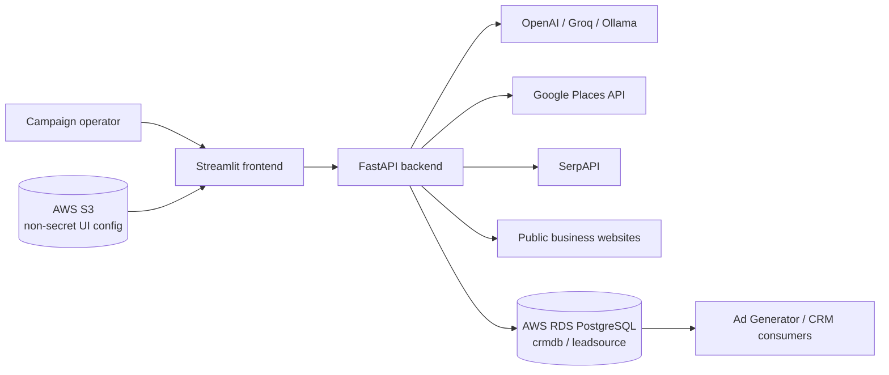
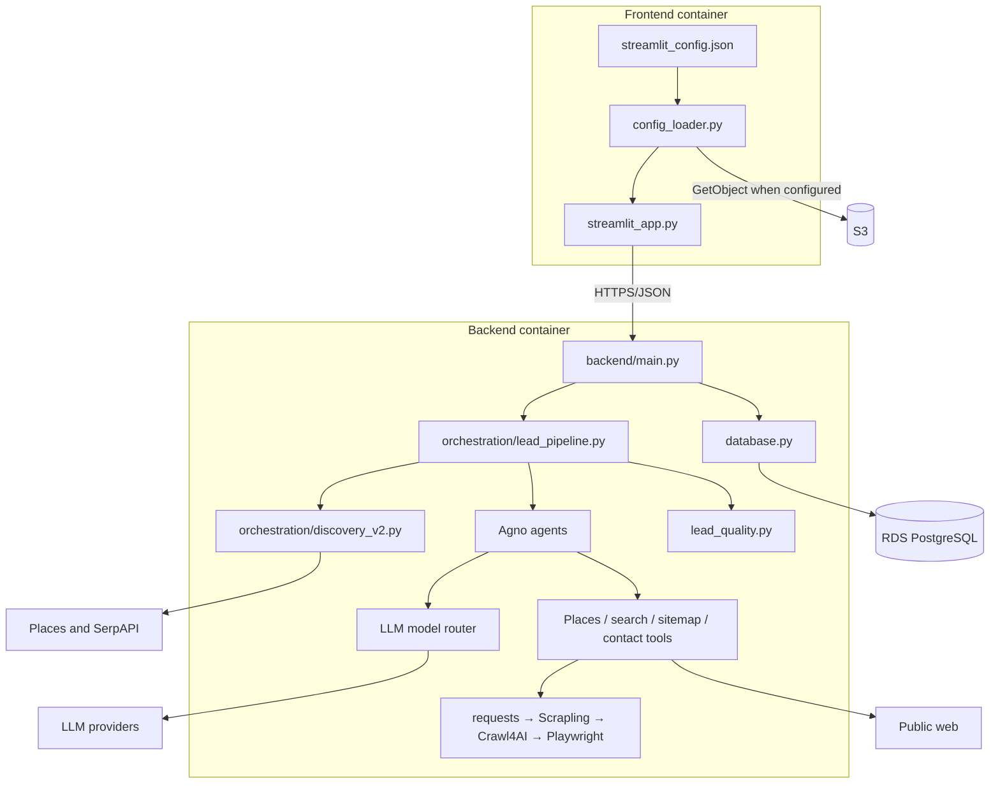
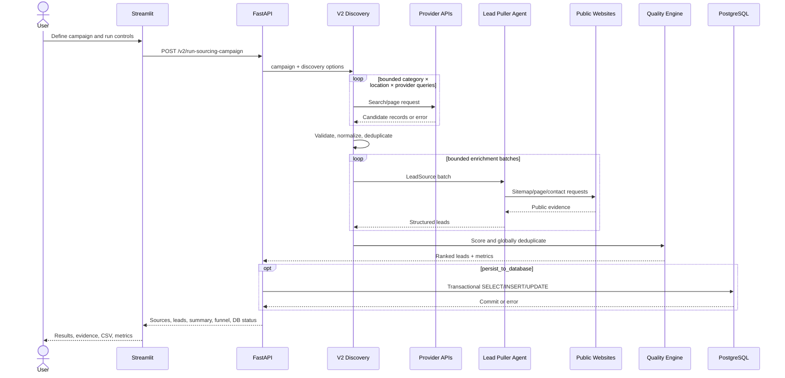
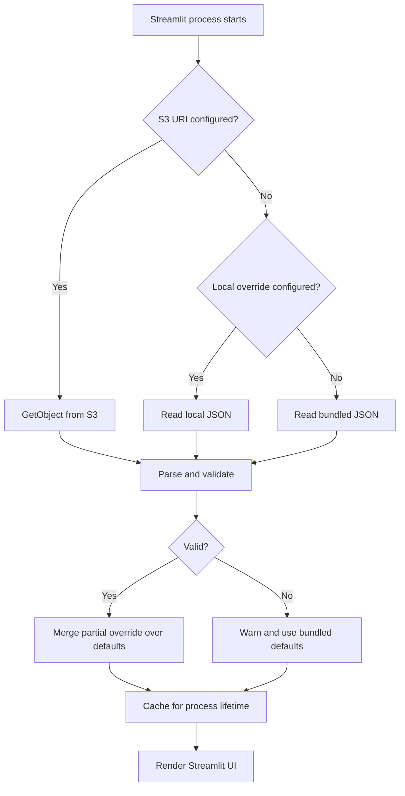
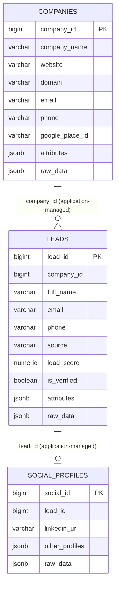
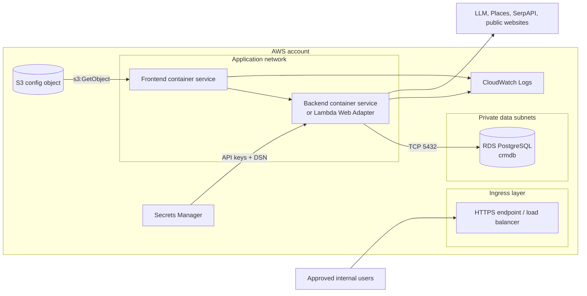
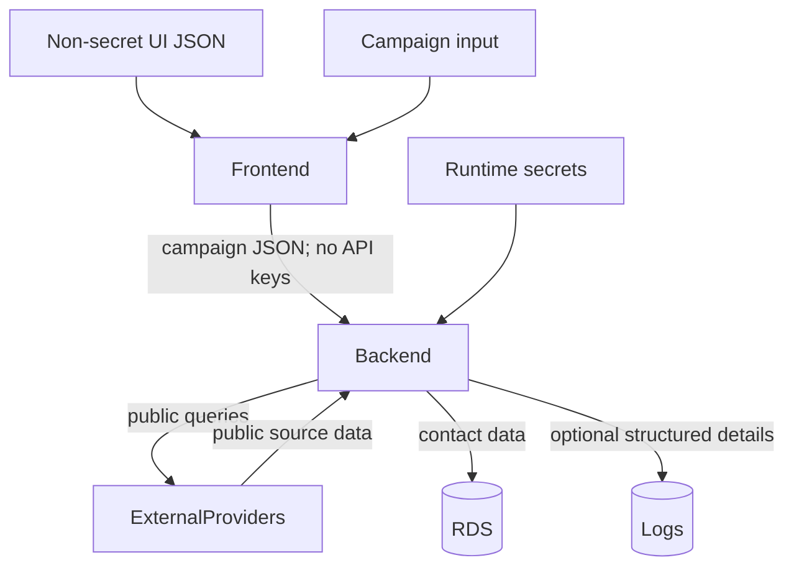

# AGFINTAX Lead Sourcing — Architecture

This document provides visual and technical architecture views. Solid paths are
implemented in the repository. AWS service placement is a reference topology;
the repository does not currently contain infrastructure-as-code.

## 1. System context

## 2. Container and component view

## 3. Campaign sequence (V2)

## 4. Frontend configuration flow

S3 takes precedence over a local override. Secrets are deliberately outside
this flow.

## 5. Data relationship view

The supplied PostgreSQL DDL contains no foreign keys; relationships are managed
by the application.

## 6. Reference AWS deployment

Recommended boundaries:

- TLS on public/internal ingress.
- Authentication in front of both frontend and API.
- Frontend role: only its S3 configuration object and logging.
- Backend role: required secrets and logging; network access to RDS and approved
  external services.
- RDS is private; its security group accepts PostgreSQL only from backend
  compute.
- Separate S3 objects, secrets, databases or schemas, and log groups per
  environment.

## 7. Runtime variants

| Variant | Frontend | Backend | Scraping |
|---|---|---|---|
| Local Python | Streamlit process | Uvicorn process | All installed engines. |
| Docker Compose | Dedicated frontend container | Dedicated backend container | Full backend image installs Chromium. |
| AWS containers | Container service chosen by platform team | Container service chosen by platform team | Full image when browser resources are supported. |
| Lambda-compatible backend | External/separate frontend | Lambda Web Adapter image | Defaults to requests + Scrapling (`SCRAPER_MAX_ATTEMPTS=2`). |

## 8. Trust boundaries and sensitive flows

The highest-risk paths are secret injection, unrestricted API exposure,
contact-data logging, and external-source compliance. See the security section
of the solution design before production approval.
